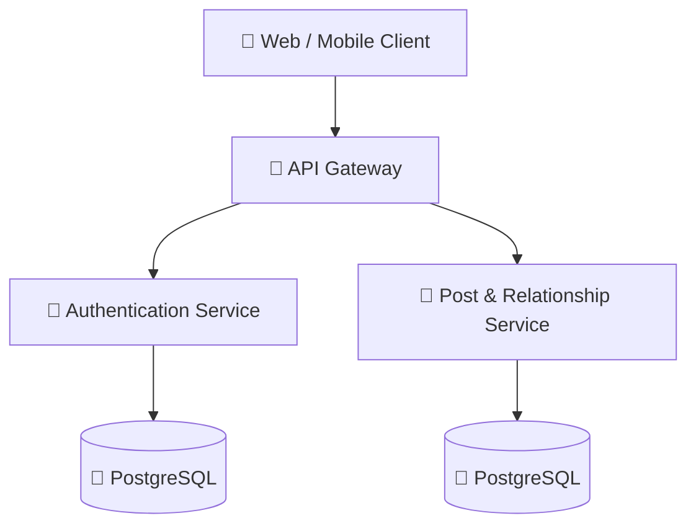

## Architecture Overview

# Social Media API Gateway

A scalable API Gateway built using Golang that acts as the single entry point for a microservices-based social media platform.

The gateway is responsible for routing requests, authentication validation, service communication, and centralized request handling between client applications and backend services.

## Architecture

The project follows a microservices architecture and currently integrates:

* Authentication Service
* Post & Relationship Service

Planned Services:

* Chat Service
* Notification Service

## Features

* JWT-based Authentication
* gRPC Service Communication
* Centralized Request Routing
* REST to gRPC Translation
* Middleware-based Authorization
* Scalable Clean Architecture
* Environment-based Configuration

## Technology Stack

* Golang
* gRPC
* Protocol Buffers
* JWT
* PostgreSQL
* Docker (Planned)

## Related Services

### Authentication Service

https://github.com/Anvarsha-k/SocialMediaAuthService

### Post & Relationship Service

https://github.com/Anvarsha-k/SocialMediaPostAndRelationService

## Future Enhancements

* Real-time Chat Service
* Notification Service
* Redis Caching
* Kubernetes Deployment
* Distributed Logging and Monitoring

This project was developed to explore scalable backend systems and microservice communication patterns commonly used in modern social media platforms.
